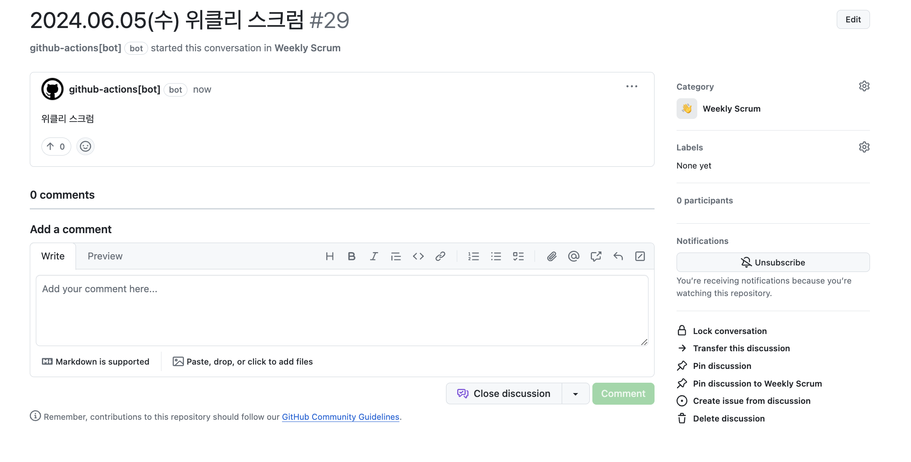

# create-discussion


## 설명

- 미리 작성된 template을 기반으로 discussion을 생성합니다.

## 사용 방법

- 프로젝트 root의 `.github/workflows` 경로에 아래와 같이 `.yaml` 파일을 작성합니다.

```yaml
# 기호에 맞게 변경해주세요
name: create discussion

on:
    schedule:
        # 생성될 시간을 기호에 맞게 작성해주세요    
        - cron: '0 0 * * 1,5'
    # 이 구문이 추가되면 actions 탭에서 직접 실행 할 수 있습니다.
    workflow_dispatch:

jobs:
    create-discussion:
        runs-on: ubuntu-latest
        steps:
            - uses: NaverPayDev/actions/discussion/create-discussion@main
              with:
                  # github action 실행을 위한 토큰입니다.
                  GITHUB_TOKEN: ${{ secrets.GITHUB_TOKEN }}
                  # (optional) 생성될 discussion의 title. 기본 값은 "discussion title" 입니다.
                  TITLE: '위클리 스크럼'
                  # (optional) 생성될 discussion의 body. 기본 값은 "discussion body" 입니다.
                  BODY: '위클리 스크럼'
                  # (optional) true일 시 제목 앞에 YYYY.MM.DD(E) 형태의 날짜를 추가합니다.
                  ADD_DATE_ON_TITLE: true


            
```

## 실행 결과


