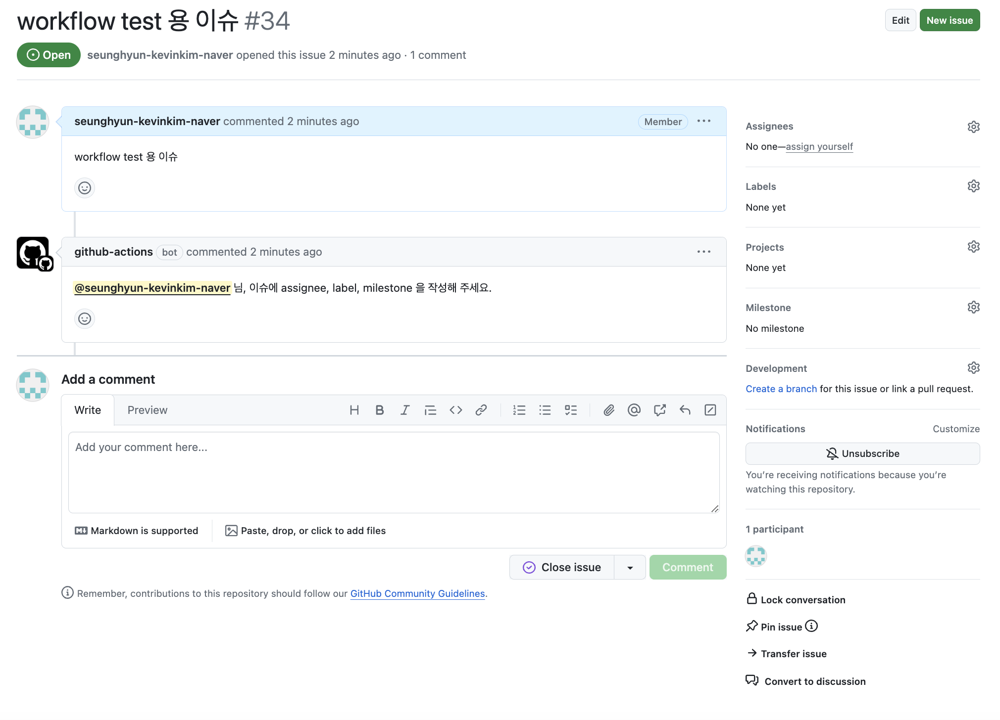

# request-issue-attribute-action


## 설명

- issue 생성 시 assignee, label, milestone 중 없는 내용에 대해 작성자에게 작성 요청 comment 를 생성합니다.

## 사용 방법

- 프로젝트 root의 `.github/workflows` 경로에 아래와 같이 `.yaml` 파일을 작성합니다.
- assignee, label, milestone 확인 여부가 모두 false라면 action이 실패합니다.

```yaml
# 기호에 맞게 변경해주세요
name: request-issue-attribute-action

on:
    # issue가 생성되었을때 실행됩니다.
    issues:
        types:
            - opened

jobs:
    request_issue_attribute:
        runs-on: ubuntu-latest
        steps:
            - uses: NaverPayDev/actions/issue/request-issue-attribute-action@main
              with:
                    # github action 실행을 위한 토큰입니다.
                    GITHUB_TOKEN: ${{ secrets.GITHUB_TOKEN }}
                    # (optional) assignee 여부를 확인할지 여부입니다.
                    CHECK_ASSIGNEE: true
                    # (optional) label 여부를 확인할지 여부입니다.
                    CHECK_LABEL: true
                    # (optional) milestone 여부를 확인할지 여부입니다.
                    CHECK_MILESTONE: true
```

## 실행 결과


