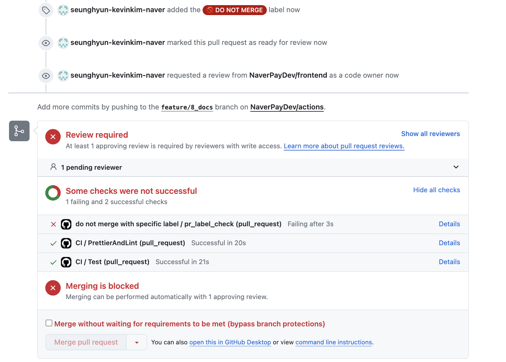

# do-not-merge-action


## 설명

- 특정 라벨이 부착된 PullRequest의 workflow를 강제로 실패시켜 병합을 방지합니다.

## 사용 방법

- 프로젝트 root의 `.github/workflows` 경로에 아래와 같이 `.yaml` 파일을 작성합니다.

```yaml
# 기호에 맞게 변경해주세요
name: do not merge action 

on:
    # Pull Request가 생성되었을때, 수정되었을때, label이 부착/탈착 되었을때 실행됩니다.
    pull_request:
        types:
            - opened
            - synchronize
            - labeled
            - unlabeled

jobs:
    pr_label_check:
        runs-on: ubuntu-latest
        steps:
            - uses: NaverPayDev/actions/pr/do-not-merge-action@main
              with:
                  # github action 실행을 위한 토큰입니다.
                  GITHUB_TOKEN: ${{ secrets.GITHUB_TOKEN }}
                  # (optional) 병합 방지 라벨명. 기본 값은 "🚫 DO NOT MERGE" 입니다.
                  BLOCKER_LABEL_NAME: '🚫 DO NOT MERGE'

```

## 실행 결과


