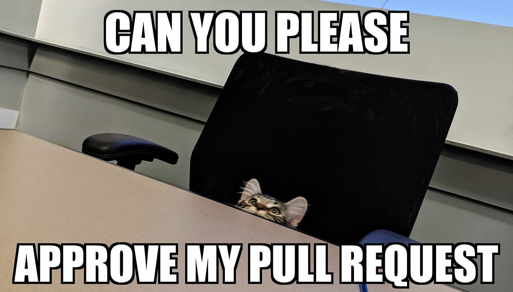
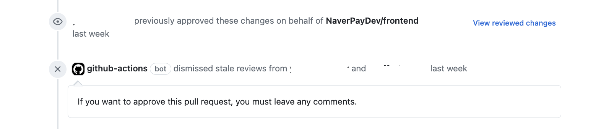

# require-approval-comment-action



## 설명

- Comment가 작성되지 않은 단순 approve를 반려합니다..

## 사용 방법

- 프로젝트 root의 `.github/workflows` 경로에 아래와 같이 `.yaml` 파일을 작성합니다.

```yaml
# 기호에 맞게 변경해주세요
name: do not merge action 

on:
    # Pull Request Review가 작성 되었을 때 실행됩니다.
    pull_request_review:
        types:
            - submitted

jobs:
    dismiss_approval_review_without_comment:
        runs-on: ubuntu-latest
        steps:
            - uses: NaverPayDev/actions/pr/require-approval-comment-action@main
              with:
                  # github action 실행을 위한 토큰입니다.
                  GITHUB_TOKEN: ${{ secrets.GITHUB_TOKEN }}

```

## 실행 결과


