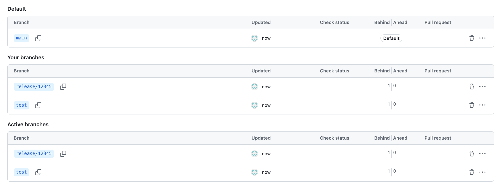
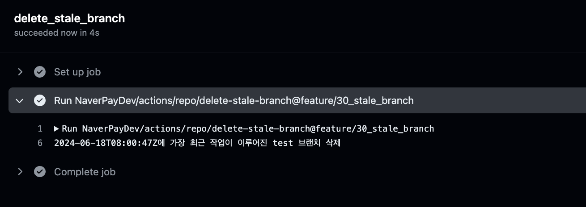

# do-not-merge-action


## 설명

- 최근 업데이트가 없는 방치된 브랜치를 삭제합니다.

## 사용 방법

- 프로젝트 root의 `.github/workflows` 경로에 아래와 같이 `.yaml` 파일을 작성합니다.

```yaml
# 기호에 맞게 변경해주세요
name: delete stale branch 

on:
    # Pull Request가 생성되었을때, 수정되었을때, label이 부착/탈착 되었을때 실행됩니다.
    schedule:
        # 삭제할 시간을 기호에 맞게 작성해주세요. 
        - cron: '0 0 1 * *' # 매달 1일 오전 9시
    # 이 구문이 추가되면 actions 탭에서 직접 실행 할 수 있습니다.
    workflow_dispatch:

jobs:
    delete_stale_branch:
        runs-on: ubuntu-latest
        steps:
            - uses: NaverPayDev/actions/repo/delete-stale-branch@main
              with:
                  # github action 실행을 위한 토큰입니다.
                  # 유의) 레포지토리에 대한 접근 권한을 가진 personal access token 발급 후 repository token으로 등록이 필요합니다
                  # see) https://docs.github.com/ko/authentication/keeping-your-account-and-data-secure/managing-your-personal-access-tokens
                  GITHUB_TOKEN: ${{ secrets.ACTION_TOKEN }}
                  # (optional) 삭제의 기준이 될 개월 수입니다. 기본 값은 3개월 입니다.
                  STALE_MONTH: 3
                  # (optional) 삭제에서 제외할 브랜치 이름 정규식입니다. 올바른 Globs 문법이 아니면 무시됩니다.
                  EXCLUDE_BRANCH_NAME_REG: '^release'

```

## 실행 결과

- 위 예시로 실행한 결과입니다. (test를 위해 stale month는 임의로 작은 수를 주입했습니다.)



